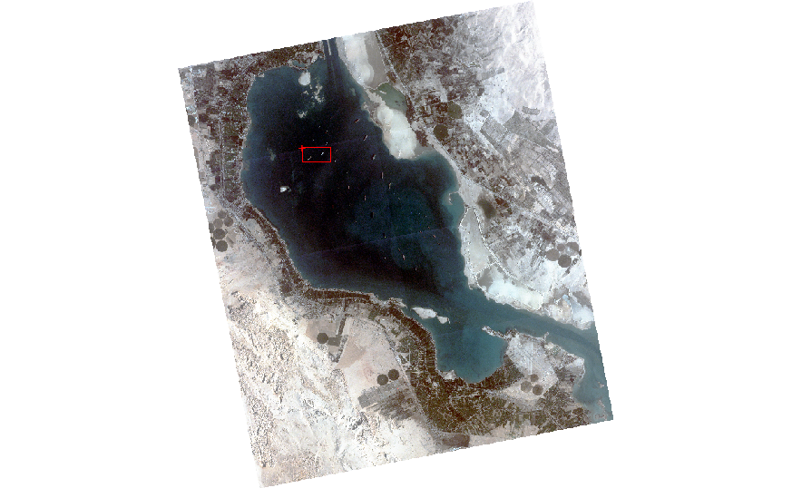
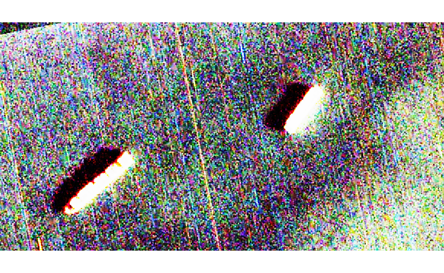
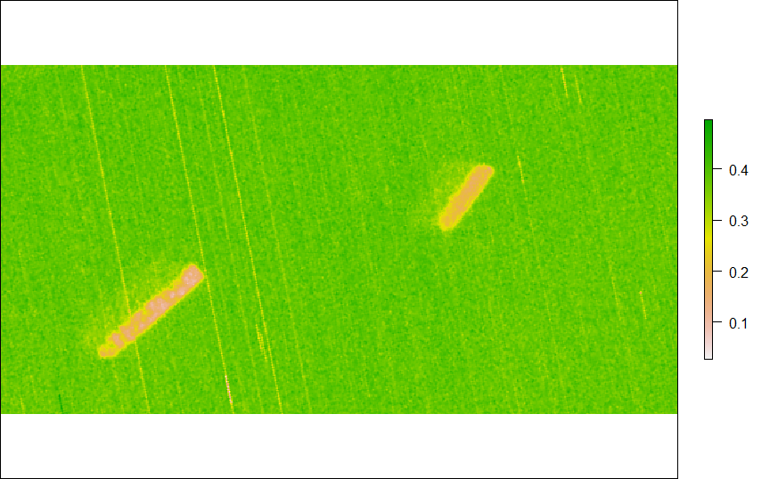
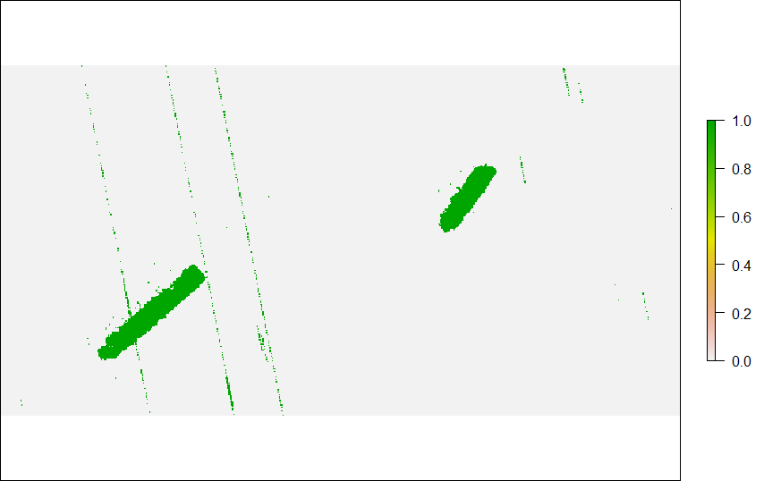
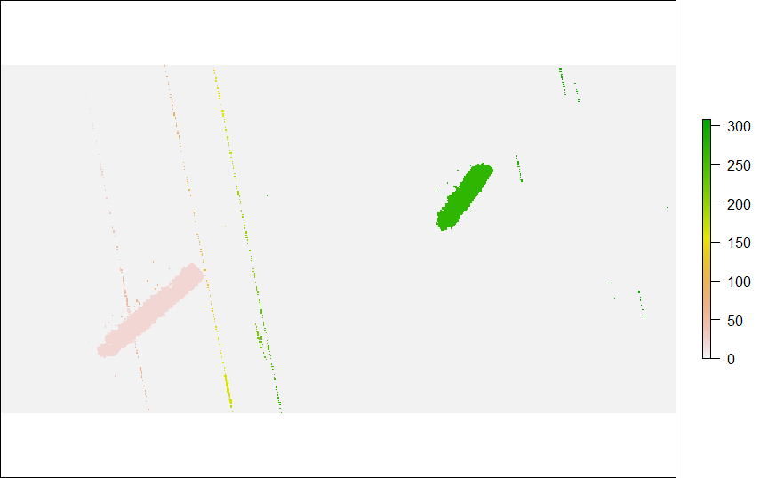
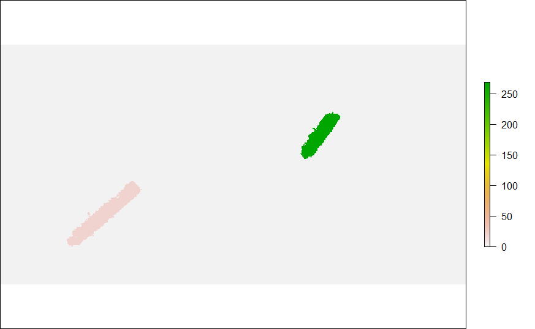

# PlanetScope-Ship-detection

## A Quick Ship detection method

### 1. Load library
```
library(raster)
library(biclust)
library(SDMTools)
```

### 2. Load PlanetScope imagery
```
great_bitter_lake = stack("great_bitter_merge.tif")
```

### 3. Plot RGB
```
plotRGB(great_bitter_lake,
        r = 3, g = 2, b = 1,
        stretch = "hist",
        legend = FALSE,
        axes = FALSE,
        box = FALSE)
```
<!-- -->

### 4. Draw AOI and crop extent
```
e <- drawExtent()
cropped_great_bitter <- crop(great_bitter_lake, e)
```
<!-- -->
<!-- -->

### 5. Calculate NDWI
```
great_bitter_lake_NDWI = (cropped_great_bitter[[2]] - cropped_great_bitter[[4]]) / (cropped_great_bitter[[2]] + cropped_great_bitter[[4]])
```
<!-- -->

### 6. Binarize
```
binwater = 1-binarize(great_bitter_lake_NDWI,threshold=0.3)
```
<!-- -->

### 7. Connected Component Labelling
```
patch = SDMTools::ConnCompLabel(binwater)
```
<!-- -->

### 8. Create dataframe 
```
patch_area = data.frame(matrix(ncol = 2, nrow = max(values(patch))))
c = c("Index", "Area")
colnames(patch_area) = c

patch_area[,1] = 1:nrow(patch_area)
```

### 9. Calculate raster area and convert the patch area lesser than 150 cell (1350 m2) into 0
```
for(i in 1:max(values(patch)))
{
  patch_area[i,2] = sum(patch[] == i)
  
  if(patch_area[i,2] <= 150)
  {
    patch[patch == i] = 0
    patch_area[i,2] = 0
  }
}
```

## NICE AND CLEAN!

<!-- -->
